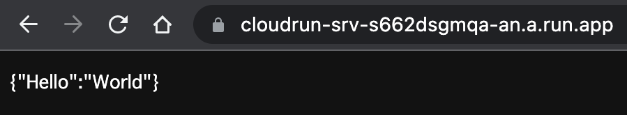

# Cloud Run Playground

Deploy original Docker image to Cloud Run using Terraform and GitHub Actions.
It uses Workload Identity for authentication with Github Actions.

## Requirements

- Google Cloud account
- gcloud CLI
- Terraform Cloud account
- Terraform CLI

## Usage

### 1. Fork this repository

### 2. Create your Google Cloud project

### 3. Create your Terraform Cloud workspace and edit `terraform/gcp.tf`

```hcl
terraform {
  ...

  cloud {
    organization = "<your organization name>"

    workspaces {
      name = "<your workspace name>"
    }
  }
}
```

### 4. Enter your `terraform/terraform.tfvars`

### 5. Set environment variables in Terraform Cloud

Authoricate and get google credentials.

```sh
cd terraform
gcloud auth application-default login
```

```sh
...
Credentials saved to file: [/<your path>/application_default_credentials.json]
...
```

Copy JSON file and set environment vavariable `GOOGLE_CREDENTIALS` from `https://app.terraform.io/app/<organization name>/workspaces/<workspace name>/variables`.

And create Terraform API token [here](https://app.terraform.io/app/settings/tokens) and set environment vavariable `TFE_TOKEN`.

### 6. Commit and push to your repository

### 7. Set `service_account` and `workload_identity_provider` to `.github/workflows/deploy.yml`

Get outputs from `https://app.terraform.io/app/<organization name>/workspaces/<workspace name>`.

`.github/workflows/deploy.yml`

```yml
...
      - id: 'auth'
        uses: 'google-github-actions/auth@v0'
        with:
          token_format: 'access_token'
          workload_identity_provider: '<Google workload identity provider>'
          service_account: '<Google service account>'
...
      - name: Build and push
        uses: docker/build-push-action@v3
        with:
          context: "{{defaultContext}}:app"
          push: true
          tags: asia-northeast1-docker.pkg.dev/<Google Cloud project id>/playground/fastapi:latest
      - id: 'deploy'
        uses: 'google-github-actions/deploy-cloudrun@v1'
        with:
          region: 'asia-northeast1'
          service: 'fastapi'
          image: 'asia-northeast1-docker.pkg.dev/<Google Cloud project id>/playground/fastapi'

```

### 8. Go



### 9. Delete `GOOGLE_CREDENTIALS` in Terraform Cloud

## References

- [Google Provider Configuration Reference: Authentication](https://registry.terraform.io/providers/hashicorp/google/latest/docs/guides/provider_reference#authentication)
- [Workload Identityを使ってJSONキーなしでGitHubActionsからGCPにアクセスする(Terraform編)](https://qiita.com/shiozaki/items/2f61489c09ff196213b4)
- [How to push tagged Docker releases to Google Artifact Registry with a GitHub Action](https://gist.github.com/palewire/12c4b2b974ef735d22da7493cf7f4d37)
- [公開（未認証）アクセスを許可する](https://cloud.google.com/run/docs/authenticating/public)
- [Cloud Run revision already exists](https://github.com/hashicorp/terraform-provider-google/issues/5898)
- [Bootstrapping trust between a TFC workspace and GCP](https://github.com/hashicorp/terraform-dynamic-credentials-setup-examples/tree/main/gcp)
- [Dynamic Credentials with the GCP Provider](https://developer.hashicorp.com/terraform/cloud-docs/workspaces/dynamic-provider-credentials/gcp-configuration)
